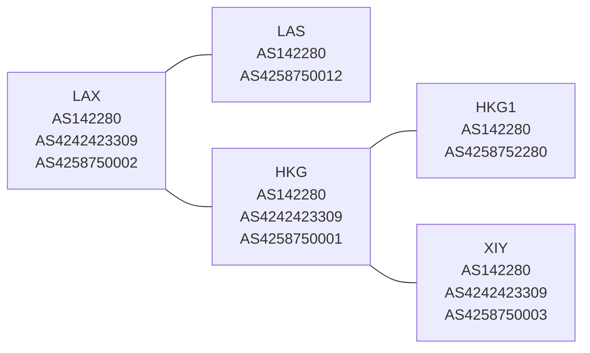

自从NTEREN DN42网的教育网西北节点由于政策原因下线以来，NTEREN的DN42网便仅剩一个节点。2022中国大学生方程式汽车大赛结束后，终于有时间对网络进行重构了，值此机会写篇文章以记录。

## 网络结构

目前重构后，NTEREN DN42网拥有三个互联的节点，分别位于洛杉矶、中国香港和中国陕西。NTEREN公网节点除DN42节点外另有独立的中国香港和拉斯维加斯两个节点。所有节点均接受对应网络的Peer。

DN42网络中，洛杉矶节点与香港节点有直接隧道连接，香港节点与陕西节点有隧道连接。节点间建立了BGP Confederation以保证内部互联和路由信息传递。Confederation的架构也保证了未来网络的可扩展性。未来可能会将另两个公网节点也接入DN42主干网。

目前NTEREN网络结构如下所示，其中`AS425875xxxx`为Confederation所用私有ASN：

## Peer信息

目前NTEREN的所有节点均接受Peer。相关信息如下

### DN42

#### 洛杉矶节点

Clearnet Host: `lax.tsinghuamakerxian.cn`

Clearnet IPv4: `63.210.148.116`

Clearnet IPv6: `2001:19f0:6001:424c:5400:3ff:fe37:9948`

DN42 IPv4: `172.23.163.161`

DN42 IPv6: `fda8:6b5c:e372:abcd::`

Link-Local IPv6: `fe80::3309`

WireGuard Pubkey: `C9QViSndf1zga5nOoSoXXMLUWBJvEFiJDWSFCbU1Ynw=`

WireGuard Port: `Last 5 digits of your ASN`

#### 香港节点

Clearnet Host: `hkg.dn42.tsinghuamakerxian.cn`

Clearnet IPv4: `43.154.38.182`

Clearnet IPv6: `None`

DN42 IPv4: `172.23.163.170`

DN42 IPv6: `fda8:6b5c:e372:42::`

Link-Local IPv6: `fe80::1:3309`

WireGuard Pubkey: `MfiVRlTTuCgS+7n3MZOQorxd1s8Kwa1piaoePn3KzgA=`

WireGuard Port: `Last 5 digits of your ASN`

#### 陕西节点

Clearnet Host: `home2.nteren.net`

Clearnet IPv4: `Dynamic`

Clearnet IPv6: `None`

DN42 IPv4: `172.23.163.177`

DN42 IPv6: `fda8:6b5c:e372:142::`

Link-Local IPv6: `fe80::2:3309`

WireGuard Pubkey: `BTntghr9wsexgdAZYGbtN9eEmEmdOGBpRSUpMe4Ma3Y=`

WireGuard Port: `Last 5 digits of your ASN`

### 公网

所有节点均接受公网IPv6 Peer。相关信息请直接联系我。联系方式可在博客首页侧边栏找到。

